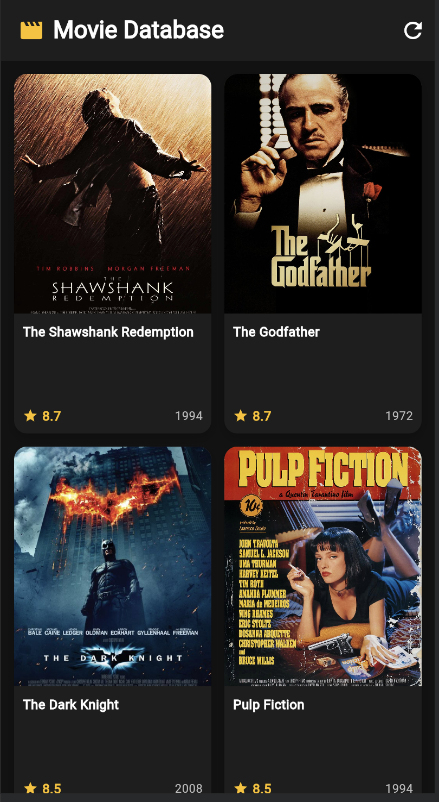
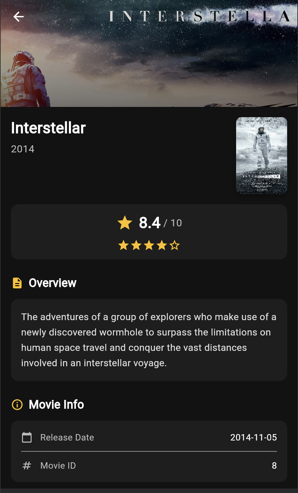

# Movie Display App

A Flutter app that showcases a curated list of classic films with posters, ratings, and detail pages in a sleek dark theme.

## Highlights
- Grid-based poster gallery with quick ratings and release year.
- Detail view with hero backdrop, synopsis, and metadata.
- Clean Material 3 styling with amber accents on a dark UI.
- Offline demo data powered by local assets (no API required).

## Screenshots
Add your screenshots here.

| Home | Details |
| --- | --- |
|  |  |

## Tech Stack
- Flutter (Material 3)
- Dart
- Local image assets

## Project Structure
```
lib/
  main.dart
  models/
    movie.dart
  screens/
    home_screen.dart
    detail_screen.dart
  widgets/
    movie_card.dart
assets/
  imdb_pictures/
```

## Getting Started
Prerequisites:
- Flutter SDK (Dart 3.10+)

Run locally:
```
flutter pub get
flutter run
```

## Notes
- Movie data is hardcoded in `lib/models/movie.dart`.
- Posters and backdrops live in `assets/imdb_pictures/`.

## Ideas to Extend
- Replace hardcoded data with a real API.
- Add search, filters, and genre chips.
- Add favorites and watchlist support.
